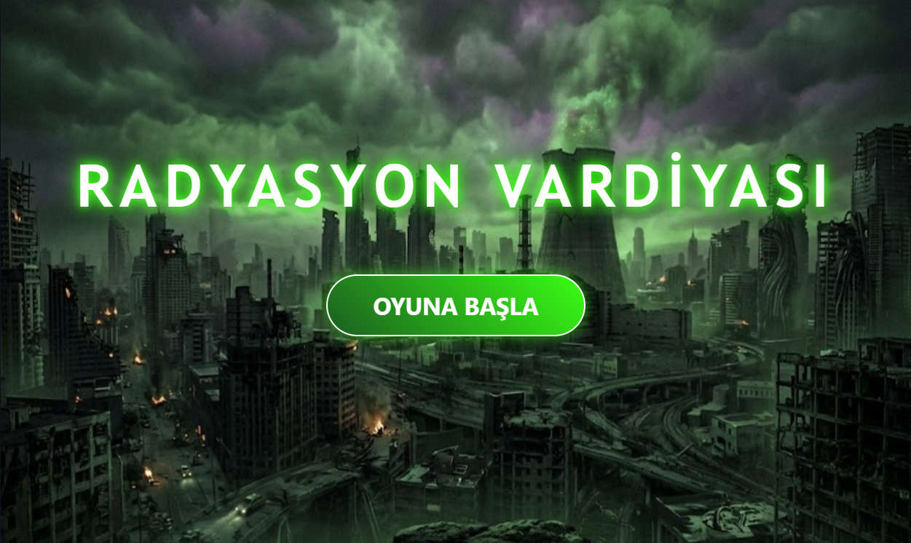
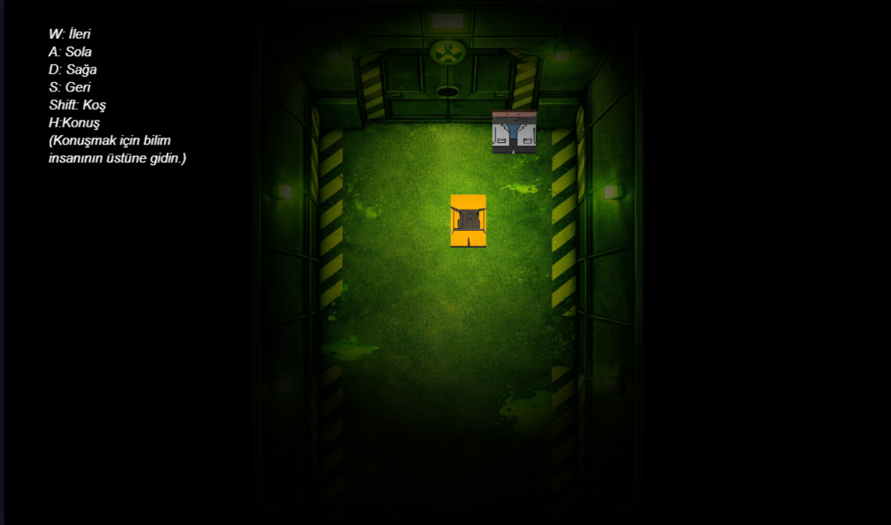
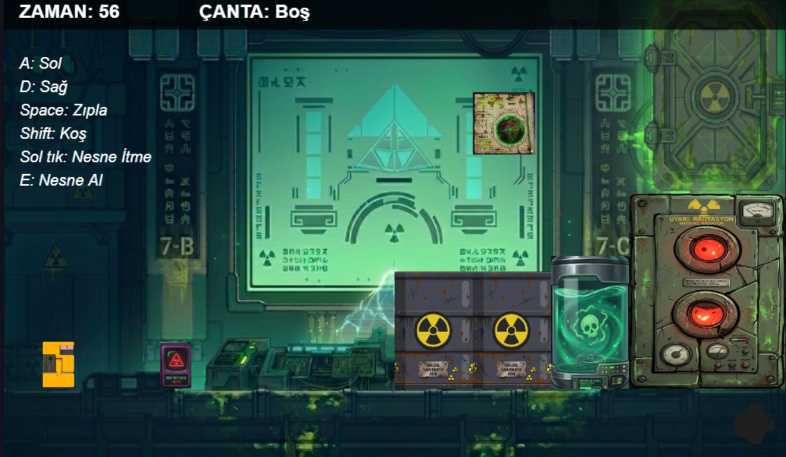
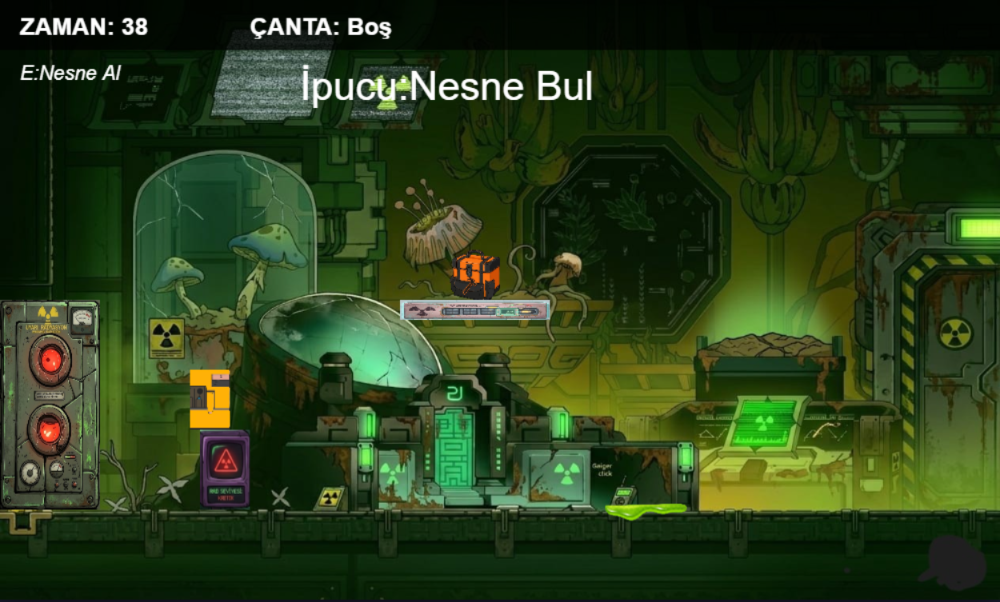
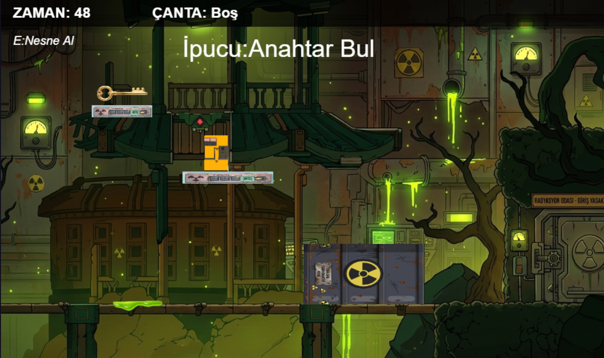
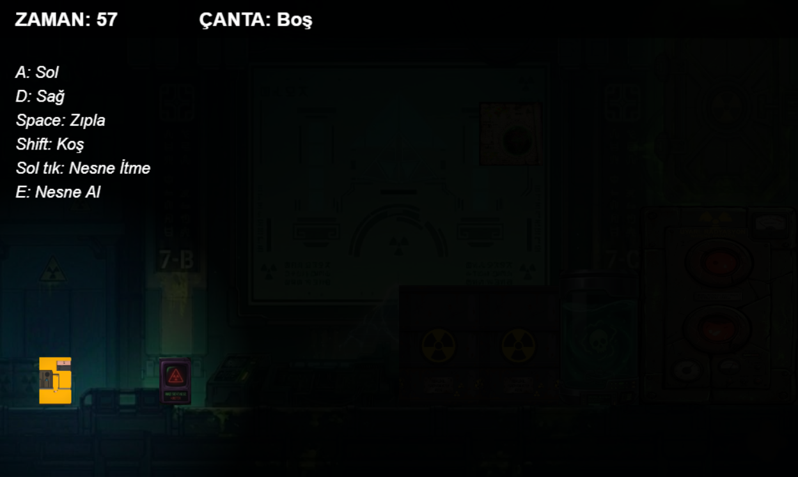
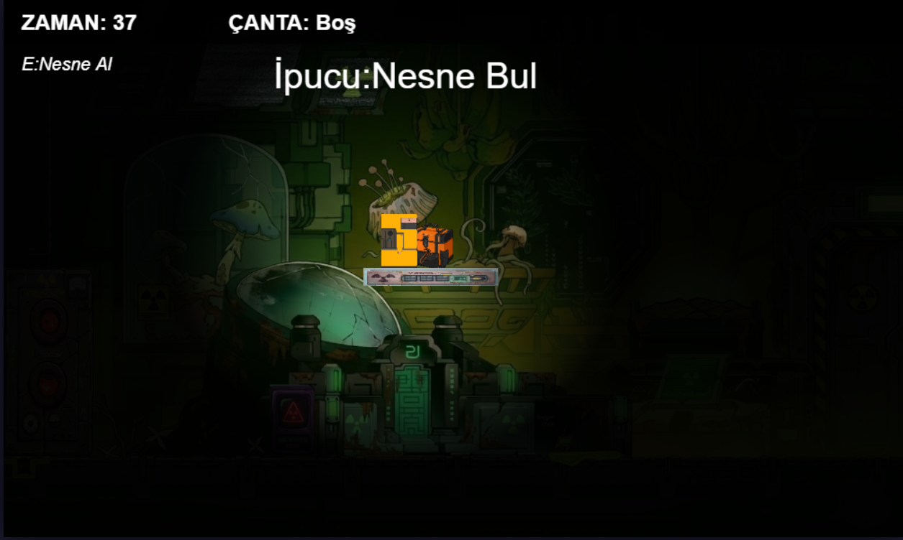
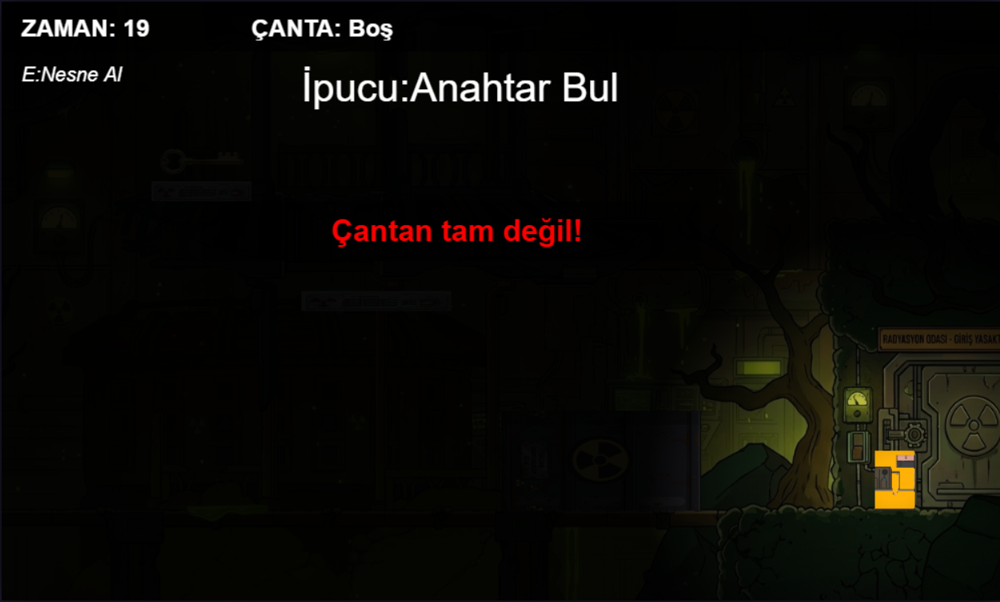

# ☢️ RADYASYON VARDİYASI 

**🎮 Oynanabilir Canlı Link:** https://berfin-turan.github.io/radyasyon-vardiyasi-oyun/

## 👥 Grup Üyeleri
* **Berfin Turan** - 24360859093
* **Meryem Dinçer** - 24360859007 

---

## 📝 Proje Hakkında
Bu proje, Web Tabanlı Programlama dersi kapsamında **HTML5 Canvas**, **JavaScript** ve **CSS** teknolojileri kullanılarak, hiçbir hazır oyun kütüphanesi (framework) kullanılmadan sıfırdan geliştirilmiştir.

**🎯 İlham Alınan Orijinal Oyun:** 
* **Oyunun Adı:** Night O'Clock
* **Oyunun Linki:** https://mrnoupgames.itch.io/night-oclock 
* *Not: Bu proje, ilgili oyunun hayatta kalma ve nesne toplama temel mekaniklerini HTML5 Canvas ortamına 2 boyutlu (2D) olarak uyarlamıştır.*

---

## ⚠️ Oyunun Amacı ve Zorluklar (Challenge)
Dünya büyük bir felaket yaşadı ve sistemler çöktü. Oyuncu olarak "Gece Mesaisi"nde (Night Shift) gözlerini açıyorsun ve her yer radyasyon altında. 

**Oyunun Amacı:** Oyuncunun temel hedefi, odalar arası geçiş yaparak sistemi onarmak için gereken **3 kritik nesneyi (Harita, Enerji Kesici ve Anahtar)** toplamaktır. 

**Karşılaşılan Zorluklar (Challenge):**
1. **Zaman Sınırı (Radyasyon Seviyesi):** Oyuncunun tüm nesneleri toplayıp bombayı imha etmesi için sadece **60 saniyesi** vardır. Süre biterse oyuncu radyasyona yenik düşer ve başa döner.
2. **Fiziksel Engeller:** Odalar arasında geçişi zorlaştıran uçurumlar ve bariyerler bulunmaktadır. Oyuncu yerçekimi fiziğine karşı platformlarda hassas zıplamalar yapmalıdır.
3. **Bulmaca ve Etkileşim:** Bazı yollar kapalıdır; oyuncunun fare ile doğru kutuları (nesne itme mekaniği) doğru yerlere iterek kendine yol yapması gerekmektedir. Eksik eşya ile çıkışa gidilirse sistem oyuncuyu geri fırlatır.

---

## ⌨️ Kontroller
Karakter hareketi ve çevre etkileşimi klavye ve fare kombinasyonu ile sağlanmaktadır:

* **[ W - A - S - D ]** : Yönlendirme (Giriş ekranında derinlikli hareket)
* **[ A - D ]** : Sağa ve Sola yürüme (Platform odalarında)
* **[ SPACE ]** : Zıplama
* **[ SHIFT ]** : Hızlı Koşma (Hızı 3 katına çıkarır)
* **[ H ]** : Bilim İnsanı (NPC) ile Konuşma
* **[ E ]** : Yerden Eşya / Nesne Alma
* **[ Sol Tık (Basılı Tutarak) ]** : Özel kutuları ve engelleri itme
* **[ ENTER ]** : Diyalogları / Hikayeyi hızlı geçme
* **[ Q ]** : Hikaye ekranından ana menüye dönme

---

## 📸 Ekran Görüntüleri
*(Not: Oyun klasöründe bulunan ekran görüntüleri aşağıdadır.)*

---

## 🛠️ Kullanılan Teknolojiler
* **HTML5 Canvas API:** 2D Çizimler, sahne renderlama ve karanlık oda (spot ışık) efektleri (`createRadialGradient`).
* **Vanilla JavaScript (ES6+):** Çarpışma testleri (AABB Collision), fizik motoru (yerçekimi ve itme kuvveti), durum yönetimi (Game State), zamanlayıcılar ve envanter dizileri (`array.includes`).
* **CSS3:** Giriş menüsündeki parlayan (neon/radyasyon) kullanıcı arayüzü ve buton tasarımları.

---

## 📂 Varlıklar ve Kaynaklar (Assets)
Projede kullanılan tüm grafik/ses varlıklarının kaynakları ve destek alınan yapay zeka araçları aşağıda belirtilmiştir:

* **Oyun Sesleri:**
* Bitiş/Başarı sesleri yapay zeka (Suno AI) ile oluşturulmuştur.
* Kutu itme sesi: https://mega-sounds.com/tr/cat-1231/sound-36375/?ysclid=mp4nid8qr8422066731
* Yakıcı sıvıya çarpınca çıkan ses: https://sounddino.com/tr/effects/game-over/ (Ve bu klarnette isimli ses)
* Envanter toplarken çıkan ses: https://sounddino.com/tr/effects/game-alerts/ (Yeni bir kart seçimi isimli ses)
* Uyarı mesajı sesi: https://sounddino.com/tr/search/?s=uyar%C4%B1  (Ksilofon uyarı sesi isimli ses )
* **Karakter Tasarımı:** Ana karakter çizimleri grubumuza aittir.

**Kullanılan Nesneler ve Engeller (Pinterest İlhamı & Gemini Düzenlemesi):**
* Engel 1, Engel 3, Oda 2 Üst: [Pinterest Linki](https://tr.pinterest.com/pin/681662093644685327/)
* Engel 2: [Pinterest Linki](https://tr.pinterest.com/pin/561472278557359499/)
* Engel 4: [Pinterest Linki](https://tr.pinterest.com/pin/291889619622083520/)
* Envanter Çantası: [Pinterest Linki](https://tr.pinterest.com/pin/931189660485378180/)
* İpucu 1 (Harita): [Pinterest Linki](https://tr.pinterest.com/pin/120893571242935860/)
* Anahtar: [Pinterest Linki](https://tr.pinterest.com/pin/4597893857038688768/)
* Oda yakıcı sıvı: [Pinterest Linki](https://tr.pinterest.com/pin/884112970567682583/)

**Arka Plan Görselleri (Pinterest İlhamı & Gemini Düzenlemesi):**
* Ana Arka Plan: [Pinterest Linki](https://tr.pinterest.com/pin/543668986274686720/)
* Oda 1 Arka Planı: [Pinterest Linki](https://tr.pinterest.com/pin/579979258301040838/)
* Oda 2 Arka Planı: [Pinterest Linki](https://tr.pinterest.com/pin/22025485673615957/)
* Oda 3 Arka Planı: [Pinterest Linki](https://tr.pinterest.com/pin/407083253827818218/)
* Giriş Ekranı (Koridor): [Pinterest Linki](https://tr.pinterest.com/pin/2392606048186677/)
